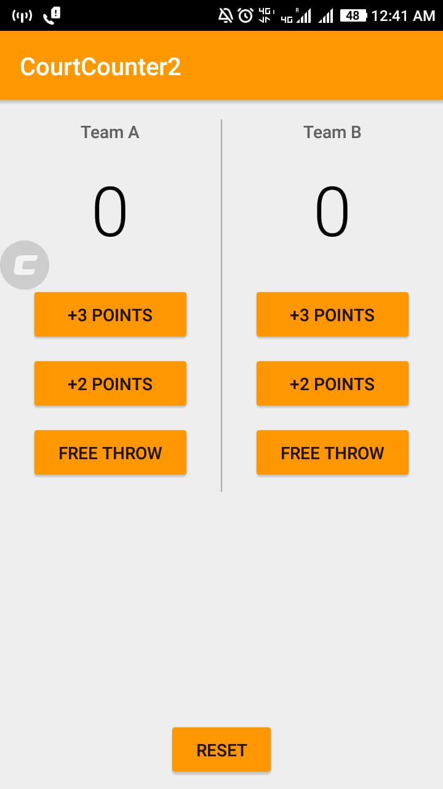
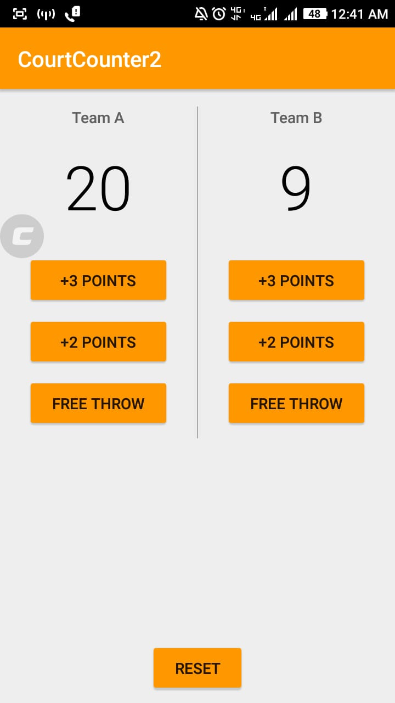

# CourtCounter
This is my second app named court counter. It helps to keep track of score of teams in a basketball match , you can also reset the score if you wish to do so. Here I learnt about using java to give functionalities to the app. I learnt to Integrate xml and java file . Learnt about views , layouts , buttons through this app.

Here are some screenshots

 
 
